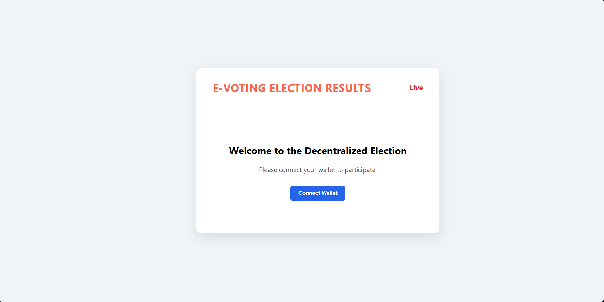
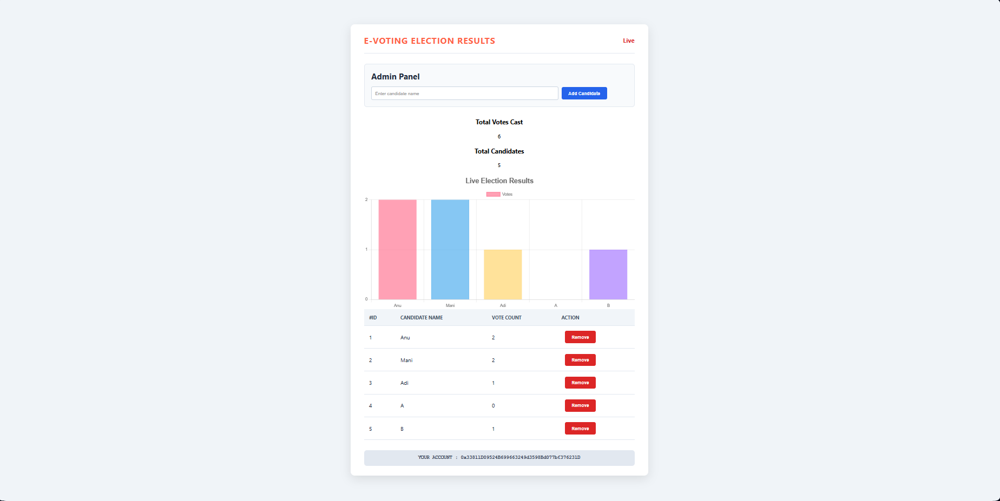
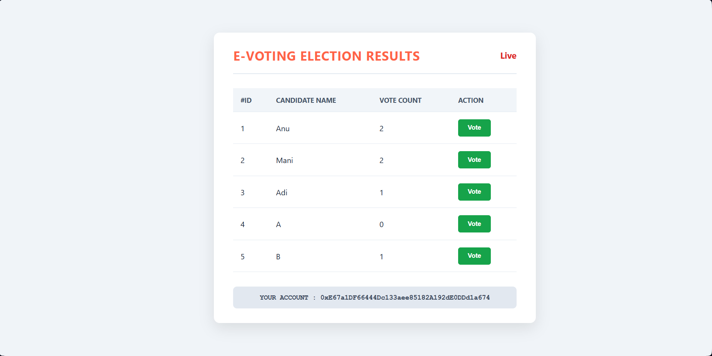
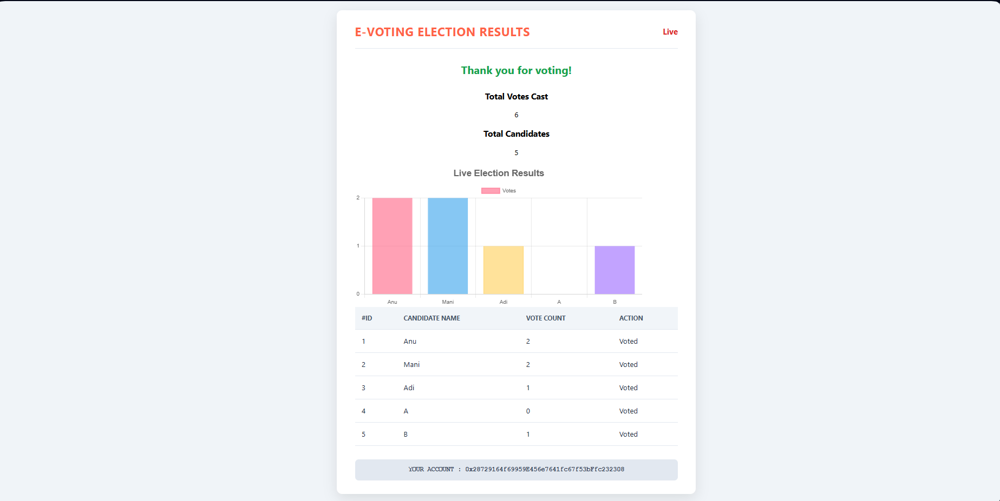

# Decentralized Voting dApp

A simple, fully functional decentralized voting application built on the Ethereum blockchain using Hardhat and React.

---
## Screenshot





---
## Features
- **Role-Based Permissions**: A contract owner (Admin) has exclusive rights to add or remove candidates.
- **Secure Voting**: The smart contract ensures that each wallet address can only vote once.
- **Live Dashboard**: The UI displays real-time statistics, including the total votes cast and the number of candidates.
- **Dynamic Bar Chart**: A visually appealing bar graph shows the current vote distribution with unique colors for each candidate.
- **Conditional UI**: The interface changes based on the user's status:
  - A "Connect Wallet" screen for new visitors.
  - An Admin Panel for the contract owner.
  - A results-focused view for users who have already cast their vote.
- **Secure Wallet Connection**: Uses MetaMask for transaction signing, ensuring user private keys are never exposed to the application.
- **Soft-Delete for Candidates**: Admins can "remove" candidates, which deactivates them without deleting historical data from the blockchain.

---
## Technology Stack
- **Blockchain**: Solidity, Hardhat, Ethers.js
- **Frontend**: React.js, Chart.js
- **Local Development**: Ganache
- **Wallet**: MetaMask

---
## Getting Started

Follow these instructions to get a local copy up and running for development and testing.

### Prerequisites
- [Node.js](https://nodejs.org/) (v18 or later)
- [Git](https://git-scm.com/)
- [Ganache](https://trufflesuite.com/ganache/) (Desktop GUI)
- [MetaMask](https://metamask.io/) browser extension

### Installation & Setup

1.  **Clone the repository:**
    ```bash
    git clone [git@github.com:adithyaa2003/Voting-dApps.git]
    cd Voting
    ```

2.  **Install backend dependencies:**
    ```bash
    npm install
    ```

3.  **Install frontend dependencies:**
    ```bash
    cd client
    npm install
    cd ..
    ```

4.  **Set up your local environment:**
    * Start the **Ganache** application.
    * Create a `.env` file in the project's root directory.
    * Copy the private key from the first account in Ganache and add it to the `.env` file:
        ```
        PRIVATE_KEY="YOUR_GANACHE_ACCOUNT_0_PRIVATE_KEY"
        ```

---
## Running the Application

1.  **Deploy the smart contract:**
    In a terminal at the project root, deploy the contract to Ganache.
    ```bash
    npx hardhat run scripts/deploy.js --network ganache
    ```
    Copy the deployed contract address that is printed to the console.

2.  **Configure the frontend:**
    Open `client/src/App.js` and paste the copied contract address into the `contractAddress` variable.

3.  **Start the frontend:**
    Open a second terminal, navigate to the `client` directory, and start the React app.
    ```bash
    cd client
    npm start
    ```
    Your application will be running at `http://localhost:3000`.

4.  **Configure MetaMask:**
    * Add Ganache as a custom network in MetaMask (`http://127.0.0.1:7545`, Chain ID `1337`).
    * Import the owner account (Account 0 from Ganache) into MetaMask using its private key to access the Admin Panel.
    * Import other accounts to test the voting functionality.

---
## Project Structure

-   **/contracts**: Contains the `Voting.sol` smart contract.
-   **/scripts**: Includes the `deploy.js` script for deploying the contract.
-   **/test**: Contains test files for the smart contract.
-   **/client**: The React frontend application.
    -   **/client/src**: Main source code for the React app, including `App.js`.
-   **hardhat.config.js**: The configuration file for the Hardhat development environment.
-   **.env**: Securely stores private keys and other secrets (not committed to Git).
